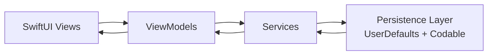

# CareBridge iOS

CareBridge iOS is a SwiftUI-based childcare management application built for keyworkers and nursery teams.
It focuses on daily operational workflows such as attendance, diary logging, incident handling, parent communication, notifications, and child profile visibility.

The app is designed as an MVP with realistic sample data, production-style modular structure, and full local persistence behavior suitable for demonstration and academic assessment.

## Highlights

- End-to-end nursery workflow support in one app.
- Strong feature modularization with clear separation of UI, state, and services.
- Real-time style UI interactions with modern SwiftUI patterns.
- Test suite includes both unit tests and UI tests.
- Debugging improvements included for deterministic test execution.

## Chosen Role and MVP Feature Justification

### Chosen User Role

Chosen role: Keyworker in a nursery/daycare setting.

Why this role is appropriate:
- Keyworkers perform high-frequency daily tasks that benefit strongly from mobile-first workflows.
- They are responsible for child-level operational records, parent-facing updates, and safeguarding-related logging.
- The app screens and data model align directly with day-to-day keyworker responsibilities.

### Two Selected MVP Features

1. Attendance Management
2. Daily Diary Logging

Why these two features:
- They represent the highest daily operational value and are used repeatedly throughout a session.
- They form a coherent workflow: attendance establishes daily presence and diary captures the day narrative.
- Both features are demonstrable, testable, and meaningful without requiring backend infrastructure.

Why realistic for a 4-week MVP scope:
- Clear domain boundaries and finite forms/workflows.
- Local persistence using UserDefaults + Codable avoids backend complexity.
- Reusable SwiftUI components reduce implementation time.
- Feature complexity is moderate and suitable for a single-student academic sprint.

## Core Features

### 1. Dashboard and Daily Operations
- Dynamic keyworker dashboard with quick actions and summary cards.
- Child-level activity snapshots.
- Sleep tracker visibility and active session indicators.

### 2. Attendance Management
- Check-in, check-out, and absence handling.
- Attendance state workflow:
	- Expected
	- Checked In
	- Checked Out
	- Absent
- Daily counts and all-children completion checks.

### 3. Daily Diary Module
- Entry types supported:
	- Activity
	- Meal
	- Sleep
	- Nappy
	- Wellbeing
	- Note
- Timeline-based diary display.
- Child filter and date-based navigation.

### 4. Incident Management
- Structured incident logging and workflow states.
- Category-based classification and severity awareness.
- Body map marker support for injury notation.
- Review and countersign simulation flow.

### 5. Messaging and Notifications
- Parent and management message feeds.
- Read/unread state management.
- In-app notification center with categorized notification types.

### 6. Profile, Settings, and End-of-Day Support
- Child profile data including health and allergy context.
- App appearance and settings management.
- End-of-day checklist support for operational completeness.

## Architecture

The project follows a clean, modular SwiftUI architecture.

- `Assignment1/Models`: Domain models (`ChildProfile`, `DiaryEntry`, `Incident`, etc.)
- `Assignment1/Services`: Data and business logic (`DataManager`, `AttendanceManager`, `MessageManager`, `NotificationManager`, `SleepTrackerManager`)
- `Assignment1/ViewModels`: Presentation logic (`DashboardViewModel`, `DiaryViewModel`, `IncidentViewModel`)
- `Assignment1/Views`: Feature screens grouped by domain
- `Assignment1/Components`: Reusable UI components
- `Assignment1/Utilities`: Constants, validation, theme, haptics, and extensions
- `Assignment1/SampleData`: Seed/mock data for realistic local usage

### Data Flow Diagram



Flow summary:
- Views capture user actions and present state.
- ViewModels coordinate screen-level logic and validation.
- Services execute business logic and manage shared app state.
- Persistence stores and reloads data across launches.

## Tech Stack

- Swift 5
- SwiftUI
- `@Observable` state management model
- UserDefaults + Codable persistence
- XCTest and XCUITest for quality validation

## Project Structure

```text
carebridge-ios/
├── Assignment1/
│   ├── Components/
│   ├── Models/
│   ├── SampleData/
│   ├── Services/
│   ├── Utilities/
│   ├── ViewModels/
│   └── Views/
├── Assignment1Tests/
├── Assignment1UITests/
└── Assignment1.xcodeproj/
```

## Setup and Run

### Requirements
- macOS
- Xcode (latest stable recommended)
- iOS Simulator

### Run from Xcode
1. Open `Assignment1.xcodeproj`
2. Select scheme: `Assignment1`
3. Choose an iOS Simulator
4. Run (`Cmd + R`)

### Run tests from command line

```bash
xcodebuild test \
	-project Assignment1.xcodeproj \
	-scheme Assignment1 \
	-destination 'platform=iOS Simulator,id=106164B2-EA5D-4269-AF18-B91F2BF4D0FE'
```

## Testing and Quality Assurance

Comprehensive tests were implemented across critical logic and user flows.

### Unit Tests
- `FormValidatorTests`
- `AttendanceManagerTests`
- `MessageManagerTests`
- `SleepTrackerManagerTests`

### Edge-Case Coverage by Feature

#### Attendance (Automated Unit Tests)
- Duplicate check-in on the same day updates existing record (idempotent behavior).
- Marking absent after check-in clears check-in/check-out times and changes state correctly.
- Day completion logic treats both checked-out and absent children as completed.
- Mixed-state counting validates present, expected, absent, and checked-out totals.

#### Diary and Form Validation (Automated Unit Tests)
- Whitespace-only inputs are treated as empty.
- Incident submission requires category, location, description, and action-taken fields.
- Minimum description length rules are enforced.
- Activity log validation rejects missing type/description combinations.

#### Incident Reporting and Body Map (Automated Unit Tests)
- Incident save flow creates submitted records with required workflow timestamps.
- Workflow status transitions (submitted to countersigned to parent-notified) are validated in view model updates.
- Body map marker add/remove behavior is tested, including safe removal from an empty list.
- Form-level required-field validation is covered through validator and incident form logic tests.

#### Messaging (Automated Unit Tests)
- Initial unread count is verified from sample state.
- Mark-read updates a single message and decrements unread count.
- Mark-all-read sets unread count to zero.
- Parent and management message buckets are validated for correctness and completeness.

#### Sleep Tracking (Automated Unit Tests)
- Duration formatting handles minute-only and hour+minute formats.
- Live timer formatting is validated in HH:MM:SS format.
- Ending a non-existent sleep session returns a safe empty result.
- Start/end sleep lifecycle updates diary entry end time and duration fields.

#### Data Persistence and App State (Runtime + Test Stability)
- Data services persist through UserDefaults + Codable save/load paths.
- Fallback to realistic sample data is used when persisted data is unavailable.
- UI test mode resets persisted keys to prevent stale-state flakiness between runs.
- Splash/onboarding launch-state edge cases are handled using launch arguments for deterministic startup.

### UI Tests
- `Assignment1UITestsLaunchTests`
- `Assignment1UITests`

### UI Edge Cases by Feature

#### App Launch
- Launch argument flow verifies deterministic startup by skipping splash/onboarding in test mode.

#### Navigation
- Core tab navigation verifies transitions across Home, Diary, Incidents, and Settings.

#### Quick Actions
- Floating action menu open/close behavior is validated for discoverability and interaction stability.

### Test Stability Improvements
- Added launch-argument driven test mode support.
- Added onboarding/splash bypass for deterministic UI tests.
- Added persistence reset hooks to reduce flaky behavior between test runs.

## Debugging Notes

Key debugging improvements completed during implementation:

- Added missing unit/UI test targets to the Xcode project.
- Stabilized UI test launch flow by handling splash/onboarding state via launch arguments.
- Reduced cross-test pollution by centralizing persistence cleanup for tests.

## Compliance and Domain Intent

The app aligns with nursery operational expectations and demonstrates consideration for:

- Daily safeguarding-related record quality
- Structured incident escalation workflows
- Parent communication clarity
- Child wellbeing and dietary/allergy sensitivity

## Future Enhancements

- Cloud-backed synchronization and multi-device support
- Authentication and role-based access control
- Push notifications
- Analytics dashboards and deeper reporting exports
- Accessibility audits and localization expansion

## License

Academic coursework/demo project.
